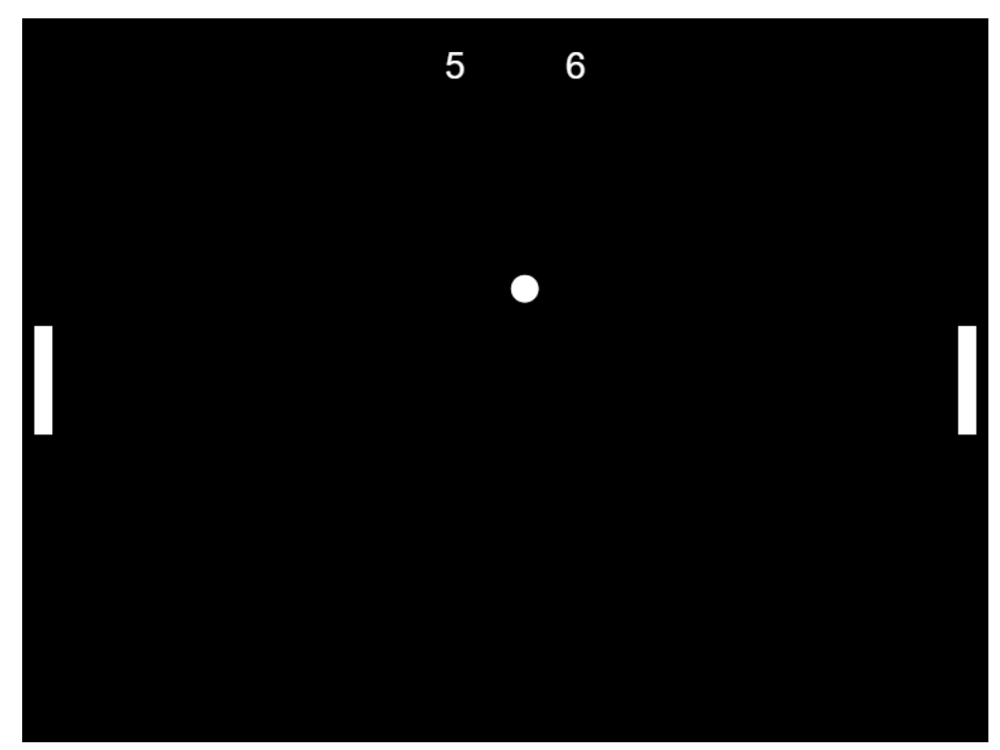

## Pong game

Custom version of a classical arcade game known as 'Pong', based on a simple two-dimensional graphical representation of a tennis-like game.

## Game rules

Players use paddles to hit a ball back and forth on a black screen. Player 1 uses keys 'w' and 's' and Player 2 'arrowUp' and 'arrowDown' to move the paddle up and down, respectively. If a player misses the ball, the opponent gets 1 pont. The game ends once a player reaches 10 points.

Just download the zip package, open the .html file and have fun!

## Technology

VanillaJS

## Screenshot

## Credits

Manufactured by Atari Inc. and originally released in 1972.
